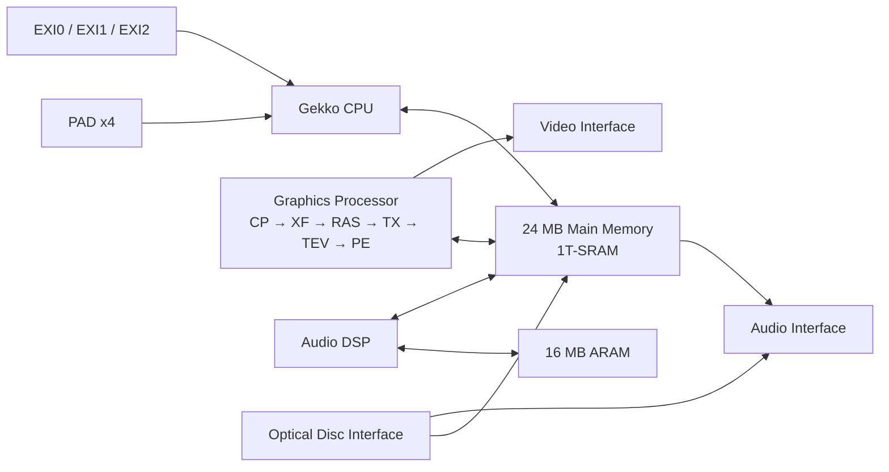
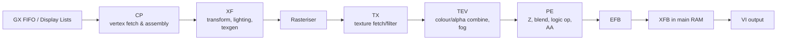

# Designing a Comprehensive Technical Reference for Nintendo GameCube Development

## Executive summary

A strong GameCube technical reference should be built on explicit evidence tiers, not on a flat mixture of fact, folklore, and emulator behaviour. The most defensible core is: public primary material from urlNintendohttps://www.nintendo.com/ and urlIBMhttps://www.ibm.com/, public ABI specifications for 32-bit Power Architecture, public headers and API documentation from urldevkitProturn30search0/libogc, and carefully labelled reverse-engineered sources such as YAGCD and the urlDolphin Emulatorhttps://dolphin-emu.org/ project. If you separate those strata clearly, the document can be both rigorous and practical. citeturn13view1turn13view2turn19view0turn30search0turn23view0

For retail GameCube development, the platform centre of gravity is straightforward: a 486 MHz Gekko CPU derived from the PowerPC 750 family; a fixed-function-but-highly-configurable graphics processor built around the CP/XF/RAS/TX/TEV/PE pipeline; 24 MB of main 1T-SRAM; 16 MB of ARAM for audio and staging; a proprietary optical-disc layout using boot headers, an apploader, a DOL executable, and an FST rather than ISO9660; and an SDK stack built around the OS, GX, MTX, PAD, optical-disc access, video, audio tools, and demo/build infrastructure. The public record is rich enough to document those elements in depth, but not rich enough to claim that every proprietary SDK detail is fully specified. Where public documentation stops, the correct wording is **unspecified**, not guesswork. citeturn13view1turn12view2turn17view3turn16view1turn38view1

If I were designing the reference itself, I would organise every chapter to answer six questions in the same order: **what the hardware/software component is; what is officially documented; what is only community-documented; how code should use it; what breaks performance; and what remains unspecified**. That structure is more valuable than a mere encyclopaedia because it gives the reader both a factual base and engineering guidance. citeturn13view1turn23view0turn30search0

## Hardware architecture

The retail console’s CPU is Gekko, described by the public architecture guide as an IBM PowerPC 750-core derivative with GameCube-specific enhancements: 486 MHz operation, a 162 MHz 64-bit bus to main memory, 32 KB 8-way L1 instruction cache, 32 KB 8-way L1 data cache, an optional 16 KB scratchpad mode for part of the D-cache, a 256 KB on-die L2 cache, a DMA unit for the scratchpad, a write-gather buffer for graphics command lists, and paired-single floating-point support. IBM’s Gekko user manual confirms that Gekko implements the 32-bit portion of the PowerPC architecture and extends it with paired-single floating-point instructions. citeturn13view1turn13view2

The 750CL belongs in the reference only as **comparative context**, not as GameCube silicon. IBM’s public 750CL documentation is later than the GameCube public architecture guide and describes a distinct 32-bit 750-family processor. That makes it useful for lineage and ABI comparison, but it should sit in an appendix entitled something like “Related 750-family cores”, not in the normative GameCube hardware chapter. Anything implying that retail GameCube consoles shipped with a 750CL would be materially misleading. citeturn13view1turn37search0turn37search1

On the graphics side, the public Nintendo architecture guide presents the GP as a sequence of functional units: CP, XF, rasteriser, texture processor, TEV, pixel engine, EFB, and XFB copy/display path. The guide also documents the most important performance characteristic for engine design: TEV complexity directly trades against fill rate. One stage peaks at 648 Mpixels/s, two stages at 324 Mpixels/s, eight stages at 81 Mpixels/s, and sixteen stages at 50 Mpixels/s. That one table tells you exactly why TEV-heavy materials must be budgeted like a scarce resource. citeturn24view0turn38view2

The audio subsystem is unusually strong for the period. Nintendo’s guide specifies a custom 81 MHz DSP with 16-bit data words and addressing, a 16-bit multiplier, a 40-bit accumulator, hardware ADPCM decompression, on-chip instruction/data RAM and ROM, DMA access to main memory, a cached ARAM interface, and a mailbox register interface with the CPU. It also attributes up to 64 stereo surround voices, 32 kHz mixing, and 48 kHz output to the DSP/AI path. citeturn38view1turn22view2

The platform’s memory story is excellent but easy to document badly. Nintendo’s diagram labels **24 MB main memory** and **2.6 GB/s**, while the CPU chapter separately states a **162 MHz 64-bit CPU bus to main memory with 1 GB/s peak bandwidth**. Those are not identical statements, and a rigorous reference should preserve the distinction rather than collapsing them into one headline number. ARAM is separately documented as **16 MB internal DRAM** with an 8-bit bus, **60–70 MB/s** DMA interface to main memory, and **80 MB/s** streaming-cache interface to the DSP. citeturn13view1turn38view1

The console I/O picture is also well documented. PAD handles up to four controllers with automatic interval sampling and support for two light guns. EXI0 and EXI1 are serial expansion interfaces with selectable 1/2/4/8/16 MHz clocks and up to 2 MB/s transfer rate. YAGCD’s EXI map places memory cards on channel 0 device 0 and channel 1 device 0, places RTC/SRAM/Mask ROM on EXI0 device 1, and identifies Serial Port 1 accessories such as the Ethernet adapter on EXI device mappings. The optical disc drive is documented as CAV, about 1.46 GB capacity, roughly 2–3 MB/s transfer, with speculative sequential prefetch and a dedicated audio-streaming path. citeturn22view4turn22view2turn23view0turn17view3

The conceptual hardware map below is a useful block diagram for the reference; it is a simplified rendering of the relationships shown in Nintendo’s architecture guide and YAGCD’s bus/device descriptions. citeturn13view1turn23view0



The table below is the minimum hardware comparison table I would include near the start of the reference. citeturn13view1turn13view2turn24view0turn38view1turn23view0

| Block | Retail characteristic | Notes for the reference |
|---|---|---|
| CPU | Gekko, 486 MHz | PowerPC 750-family derivative with paired-single FP, scratchpad-capable D-cache mode, 256 KB L2 |
| CPU caches | 32 KB L1 I, 32 KB L1 D, 256 KB L2 | D-cache can be split into 16 KB cache + 16 KB scratchpad |
| CPU memory bus | 162 MHz, 64-bit, 1 GB/s peak | Use this as the CPU-side guaranteed figure |
| GP pipeline | CP → XF → Rasteriser → TX → TEV → PE | This is the core mental model for GX |
| TEV | Up to 16 stages | Fill-rate cost scales directly with stage count |
| Embedded graphics memory | 1 MB TMEM, EFB in embedded 1T-SRAM | EFB/XFB distinction must be explained early |
| Main memory | 24 MB 1T-SRAM | Nintendo diagram labels 2.6 GB/s at system level |
| ARAM | 16 MB DRAM | Mainly audio, but useful as staging/storage |
| Audio DSP | 81 MHz, 16-bit datapath, 40-bit accumulator | Hardware ADPCM decompression |
| Disc drive | 1,459,978,240 bytes, CAV, ~2–3 MB/s | Random access is much slower than N64 mask ROM |
| Controllers | Up to 4 | Automatic sampling, motor control, light-gun support |
| EXI | EXI0/1 serial ports, up to 2 MB/s | Cards, RTC/SRAM/Mask ROM, serial accessories |

## Software, SDK, OS, and ABI

Nintendo’s public architecture guide gives an unusually clear top-level inventory of the official SDK. It lists the operating system, optical disc file system, PAD library, 3D graphics library, matrix library, 2D graphics library, video display library, demonstration library, texture conversion tools, wavetable and sound-effects tools/libraries, and the optical-disc streaming library. It also states that developers could use either the CodeWarrior suite or the ProDG suite, and that the SDK shipped with demo programs and a Makefile-based build environment under Cygwin. That is enough to design a clean “official SDK components” chapter without leaning on non-public manuals. citeturn16view1turn16view2turn17view3

The official OS model exposed by Nintendo is also clear at the architectural level. The OS distinguishes cached and uncached access ranges, supports threads and interrupt-event callback handlers, provides message queues and condition variables, and includes mutual-exclusion support for re-entrant code. The utility layer includes multi-heap allocation, stopwatch/alarm facilities, and dynamic relocatable modules. A comprehensive reference should therefore have separate subsections for **memory mapping**, **threading/execution model**, **interrupts/exceptions**, **allocation**, and **disc/file APIs**. citeturn17view1turn17view2turn17view0

The public memory map is one of the most useful tables in YAGCD and should be reproduced in cleaned-up form. In particular, developers need to know the cached and uncached aliases for main RAM, the hardware-register window, and the GX FIFO mapping. YAGCD also documents low-memory globals such as the physical memory size, bus clock, CPU clock, FST location, and exception vectors. citeturn15view0

| Region | Typical meaning |
|---|---|
| `0x00000000`–`0x017fffff` | Physical 24 MB main RAM |
| `0x80000000`–`0x817fffff` | Cached logical alias of main RAM |
| `0xC0000000`–`0xC17fffff` | Uncached logical alias of main RAM |
| `0xC8000000` | Embedded frame buffer window |
| `0xCC000000` | Hardware-register space |
| `0xCC008000` | GX FIFO / graphics command path |
| `0xE0000000`–`0xE0003fff` | Locked L2-cache window |
| `0xFFF00000` | IPL mapped at boot |

A note under that table should call out the most useful low-memory globals: `0x80000028` physical memory size, `0x800000F8` bus clock, `0x800000FC` CPU clock, `0x800000F4` BI2 location, and the exception vectors beginning at `0x80000100`. citeturn15view0

For ABI and calling convention, the most stable public basis is the 32-bit Power Architecture ABI plus the fact that modern homebrew GameCube development uses `powerpc-eabi` toolchains. The safe rule set for the reference is: integer/pointer arguments and integer return values in `r3`–`r10`, `r1` as stack pointer, `r13` as small-data-area pointer, `r14`–`r31` callee-saved, `LR` volatile, and 16-byte stack-frame alignment with a downward-growing stack. Those rules are exactly the kind of thing that belong in a one-page “ABI quick sheet” chapter. citeturn20view0turn20view1turn20view2turn20view3turn8search10

Where public documentation is incomplete, the reference should say so. The retail architecture guide describes execution model and SDK composition, and libogc exposes equivalent homebrew-facing APIs such as `PAD_*`, `CARD_*`, `AUDIO_*`, and `LWP_*`, but a legitimately public, function-by-function official Programmer’s Guide is not fully specified in primary public sources. In those places, document behaviour from public headers and mark provenance clearly rather than implying that the entire proprietary SDK surface is publicly documented. citeturn28search2turn31view2turn31view3turn32view0

## Disc, file system, and executable formats

Retail GameCube discs do **not** use ISO9660 in the ordinary PC sense. Community tools often call a raw disc image an `.iso` or `.gcm`, but the documented on-disc structure is proprietary: `boot.bin` at `0x00000000`, `bi2.bin` at `0x00000440`, the apploader at `0x00002440`, followed by the file system table, with the main DOL executable and FST offsets stored in the disc header. A good reference should state that plainly to prevent one of the most common beginner mistakes. citeturn12view1turn13view0

The disc header fields that matter most for tooling are likewise clear in YAGCD: game code, maker code, disc ID, version, audio-streaming flag, disc magic word `0xC2339F3D`, game name, debug-monitor offsets, DOL offset at `0x0420`, FST offset at `0x0424`, FST size at `0x0428`, and FST max size at `0x042C`. The BI2 block carries debug-monitor size, simulated memory size, argument offset, debug flag, track location/size, and country code. The apploader header includes a date string, entry point, code size, and trailer size, and YAGCD documents the apploader load address as `0x81200000`. citeturn12view2turn12view4turn13view0

The FST itself is simple and important: a 12-byte root directory entry, followed by 12-byte file/directory entries, followed by a string table. Each entry contains a file/directory flag, a 24-bit name offset into the string table, and either file metadata or parent/next offsets for directories. That means the “file system” chapter of the reference should teach the format as a tree of entries plus a string table, not as a sector-based volume with ISO9660 descriptors. citeturn13view0

A standard GameCube retail disc does **not** have the Wii-style encrypted partition table model. For ordinary GameCube discs, partitioning is best documented as **not applicable / unspecified in public GameCube docs beyond the flat boot/apploader/FST layout**. YAGCD also documents `TGC` as a separate proprietary embedded image format used on some demo discs and by a few embedded applications; that belongs in a separate “container variants” subsection. citeturn12view2

For memory cards, YAGCD provides both the transport-level view and the on-card file-system view. The first five `0x2000`-byte blocks are reserved for filesystem structures: header, directory, directory backup, block-allocation map, and BAM backup. Directory entries store game code, maker code, banner/icon metadata, filename, timestamps, permissions, first-block pointer, file length in blocks, and comment offsets. YAGCD also identifies `GCI` as a 64-byte save header plus file data, and `GCP` as a raw memory-card image. These formats deserve their own appendix because save tooling, archival work, and homebrew launchers all depend on them. citeturn13view3turn12view2

The condensed format table below is the best shape for the document. citeturn12view1turn13view0turn13view3turn12view2

| Format / object | Role | Publicly documented structure |
|---|---|---|
| `boot.bin` | Disc header | Game/maker IDs, magic, DOL/FST offsets and sizes |
| `bi2.bin` | Disc info block | Simulated memory size, debug info, country code |
| `appldr.bin` | Loader | Header + code + trailer, loads main executable |
| DOL | Main executable | Custom executable format, loaded by apploader |
| FST (`fst.bin`) | Filesystem tree | 12-byte entries + string table |
| `.gcm` / raw `.iso` | Community image naming | Raw GameCube disc image, not ISO9660 volume metadata |
| `TGC` | Embedded GameCube container | Separate header with embedded GCM offsets |
| Memory-card filesystem | Card save volume | Header, dir, BAM, backups, file data |
| `GCI` | Exported save file | 64-byte header plus save payload |
| `GCP` | Card image | Raw full-card image |

## GX graphics pipeline and optimisation

Nintendo describes GX as a thin logical API above hardware, and that is the correct way to frame it. The API is not an abstract retained-mode scene graph; it is a high-performance command frontend to a pipeline whose real stages are the command processor, transform unit, rasteriser, texture processor, TEV, pixel engine, EFB, and display-copy path. Your reference should therefore teach **GX by pipeline stage**, not alphabetically by function. That is the clearest route from “what function should I call?” to “what hardware am I programming?”. citeturn16view1turn24view0turn38view2

The pipeline flowchart below is the right level of abstraction for the graphics chapter. citeturn24view0turn38view2



The TEV chapter should be treated as the centrepiece of the graphics section. Nintendo’s public documentation states that TEV supports up to 16 stages and gives the per-stage blending equation in the form `R1 = A * (1 - C) + B * C`, followed by additive/subtractive/bias/shift/clamp processing. It also notes that each stage can source from 14 possible inputs and that fog is computed after stage blending. In other words, TEV is effectively the material/shader language of GameCube, and any serious reference must make it first-class rather than marginal. citeturn24view0

The TEV comparison table below is worth including verbatim in spirit, because it turns a qualitative idea into a hard budget. citeturn24view0

| TEV stages | Peak pixel fill rate |
|---|---:|
| 1 | 648 Mpixels/s |
| 2 | 324 Mpixels/s |
| 3 | 216 Mpixels/s |
| 4 | 162 Mpixels/s |
| 5 | 130 Mpixels/s |
| 6 | 108 Mpixels/s |
| 7 | 93 Mpixels/s |
| 8 | 81 Mpixels/s |
| 16 | 50 Mpixels/s |

Texture handling also deserves careful treatment. Public GX/libogc headers expose the texture formats `GX_TF_I4`, `I8`, `IA4`, `IA8`, `RGB565`, `RGB5A3`, `RGBA8`, `CI4`, `CI8`, `CI14`, and `CMPR`, with TLUT formats `IA8`, `RGB565`, and `RGB5A3`. Public GX documentation also describes tiled texture storage in 32-byte tiles, 32-byte alignment requirements, support for trilinear mipmaps, and S3TC/CMPR compressed textures. That means the texture chapter should be structured around **layout**, **format**, **filtering**, **mipmapping**, **palette/TLUT**, and **copy/preload/streaming behaviour**. citeturn26search1turn24view3turn26search3turn26search7

A compact texture-format table is useful because the same information recurs across art, tools, and runtime chapters. citeturn26search1turn26search3

| Family | Public GX names | Notes |
|---|---|---|
| Intensity / intensity-alpha | `I4`, `I8`, `IA4`, `IA8` | Small, cache friendly, good for masks and light maps |
| Direct colour | `RGB565`, `RGB5A3`, `RGBA8` | `RGB5A3` is a common mixed-opacity format |
| Colour-indexed | `CI4`, `CI8`, `CI14` | Requires TLUT; TLUT formats are `IA8`, `RGB565`, `RGB5A3` |
| Compressed | `CMPR` | S3TC-like 4 bpp format; saves RAM and TMEM bandwidth |
| Copy-texture formats | `CTF_*` | Used for EFB copy paths, not ordinary source-asset authoring |

On optimisation, the public evidence leads to a handful of high-confidence rules. Prefer indexed arrays and display lists where possible, because the CP explicitly supports both and the architecture guide highlights the vertex cache and display-list path. Keep frequently reused textures resident or effectively resident, because TMEM is limited and Nintendo documents both explicit preloading and the texture streaming cache. Budget TEV stages aggressively, because fill rate drops as stage count rises. Merge disc assets into larger contiguous sets, because Nintendo documents random-access optical seeks at over 100 ms. Use ARAM as a staging reservoir when that helps hide disc latency. And align DMA-facing buffers to 32 bytes, because both audio and card APIs document that requirement publicly. citeturn24view1turn38view1turn24view0turn17view3turn31view3turn39view1

A concise “GX registers and command encodings” table is also essential. YAGCD is the right public source for this layer. citeturn34view0turn35view0turn35view2turn34view2

| Interface | Value / register | Purpose |
|---|---|---|
| GX FIFO MMIO | `0xCC008000` | CPU write-gather path for GP command traffic |
| Opcode | `0x40` | Call display list |
| Opcode | `0x48` | Invalidate vertex cache |
| Opcode | `0x61` | BP command |
| Opcode | `0x08` | CP command |
| Opcode | `0x10` | XF command |
| BP reg | `0x00 GEN_MODE` | Global raster/TEV mode configuration |
| BP regs | `0x20/0x21` | Scissor top-left / bottom-right |
| BP reg | `0x40 PE_ZMODE` | Z enable, compare function, update mask |
| BP reg | `0x41 PE_CMODE0` | Blend/logic-op/colour-mask state |
| BP reg | `0x43 PE_CONTROL` | Pixel format, Z-format, Z-comp location |
| BP regs | `0x47/0x48` | Token / token interrupt |
| XF reg block | `0x1000+` | XF control/register space |

## Toolchains, build systems, debugging, and profiling

The official development picture was built around Nintendo’s SDK, Makefile-driven demos, and debugger/compiler suites such as CodeWarrior and ProDG. Nintendo’s architecture guide also documents the DDH development hardware, including optical-disc emulation, direct PC communication, and **48 MB** of main memory on the development system. That difference matters: a rigorous reference must flag every DDH-only convenience so readers do not accidentally design past retail’s 24 MB limit. citeturn17view3turn16view4

For modern homebrew, the dominant public stack is `powerpc-eabi` via urldevkitProturn30search0 and libogc. DevkitPro publicly describes itself as a provider of homebrew toolchains distributed via `pacman`, and its organisation page explains that libogc is the C library for Wii and GameCube homebrew. Public libogc headers expose the modern API surface for PAD, CARD, AUDIO, GX, and lightweight threading. That is the correct foundation for a “modern toolchain” chapter. citeturn30search0turn30search3turn28search2turn31view2turn31view3turn32view0

For emulation and debugging, urlDolphin Emulatorhttps://dolphin-emu.org/ is indispensable. Dolphin’s official material includes a FIFO Player, which is ideal for graphics-command inspection and regression reduction. For image and filesystem work, the public community tool landscape includes GCRebuilder as a long-standing Windows ISO/GCM rebuilder and GCFT as a modern GUI multi-tool for GCM, BTI, RARC, J3D, and related GameCube formats. Those tools belong in a “workflow and utilities” chapter, but they should be labelled clearly as **community tooling**, not part of the original Nintendo SDK. citeturn8search2turn21search0turn21search7

Build-system advice should be practical, not nostalgic. The official SDK history justifies a Makefile-first approach, and modern devkitPro tooling still fits that well. If you add CMake or another meta-build layer, treat it as a project convenience rather than as a normative GameCube requirement. The reference should also define one canonical project layout and keep generated artefacts, raw assets, converted assets, disc-layout metadata, and final binaries physically separate. citeturn17view3turn30search0

The file layout below is what I would recommend as the default documented structure. It is a recommendation, not a historic requirement. 

| Path | Purpose |
|---|---|
| `docs/official/` | Public primary documents, notes, excerpts, errata |
| `docs/reverse/` | YAGCD, Dolphin notes, reverse-engineering supplements |
| `include/` | Public project headers |
| `src/core/` | Boot, OS wrappers, memory, timing |
| `src/gx/` | GX state setup, materials, draw submission |
| `src/audio/` | DSP/AI wrappers, mixers, streamers |
| `src/input/` | PAD handling, abstraction layer |
| `src/storage/` | Disc, FST, memory-card I/O |
| `src/platform/` | SDK/homebrew compatibility shims |
| `assets/raw/` | Source art, audio, text, authoring files |
| `assets/converted/` | TPL/BTI/DSP-ADPCM/other runtime-ready assets |
| `disc/` | Disc-root layout, `opening.bnr`, build manifest |
| `tools/` | Converters, packers, validators, host utilities |
| `build/` | Object files, maps, intermediates |
| `dist/` | `.dol`, `.gcm`, logs, symbol maps |
| `tests/` | Host-side parsers, format tests, golden data |
| `scripts/` | Build, asset, packaging, CI helpers |

The biggest pitfalls are stable enough to warrant a dedicated boxed warning section: assuming ISO9660 semantics on disc images; designing content for DDH’s 48 MB instead of retail’s 24 MB; overusing TEV stages until fill rate collapses; packing data into too many tiny disc files; and forgetting 32-byte alignment for DMA-, audio-, and card-facing buffers. Every one of those mistakes is predictable from the public documentation. citeturn17view3turn12view1turn24view0turn31view3turn39view1

## Sample code and recommended implementation patterns

The code below is written in a libogc-style public API idiom, because that is the best documented legitimate public interface for homebrew. It is intended as a reference skeleton, not as a drop-in engine. The main constraints it obeys are the publicly documented GX FIFO model, 32-byte alignment for DMA/card/audio buffers, and the PowerPC EABI calling model summarised above. citeturn28search2turn31view2turn31view3turn32view0turn20view2turn20view3

### Initialisation, render loop, and vertex submission

```c
#include <gccore.h>
#include <ogc/pad.h>
#include <string.h>

static GXRModeObj *rmode;
static void *xfb[2];
static u32 xfb_index = 0;
static u8 gp_fifo[256 * 1024] ATTRIBUTE_ALIGN(32);

static void init_video_and_gx(void) {
    VIDEO_Init();
    PAD_Init();

    rmode = VIDEO_GetPreferredMode(NULL);
    xfb[0] = MEM_K0_TO_K1(SYS_AllocateFramebuffer(rmode));
    xfb[1] = MEM_K0_TO_K1(SYS_AllocateFramebuffer(rmode));

    VIDEO_Configure(rmode);
    VIDEO_SetNextFramebuffer(xfb[0]);
    VIDEO_SetBlack(FALSE);
    VIDEO_Flush();
    VIDEO_WaitVSync();
    if (rmode->viTVMode & VI_NON_INTERLACE) {
        VIDEO_WaitVSync();
    }

    GX_Init(gp_fifo, sizeof(gp_fifo));

    GX_SetCopyClear((GXColor){0x10, 0x18, 0x28, 0xff}, 0x00ffffff);
    GX_SetViewport(0.0f, 0.0f, (f32)rmode->fbWidth, (f32)rmode->efbHeight, 0.0f, 1.0f);
    GX_SetScissor(0, 0, rmode->fbWidth, rmode->efbHeight);

    GX_SetDispCopySrc(0, 0, rmode->fbWidth, rmode->efbHeight);
    GX_SetDispCopyDst(rmode->fbWidth, rmode->xfbHeight);

    f32 yscale = GX_GetYScaleFactor(rmode->efbHeight, rmode->xfbHeight);
    GX_SetDispCopyYScale(yscale);

    GX_SetCopyFilter(rmode->aa, rmode->sample_pattern, GX_TRUE, rmode->vfilter);
    GX_SetCullMode(GX_CULL_BACK);
    GX_SetDispCopyGamma(GX_GM_1_0);

    GX_ClearVtxDesc();
    GX_SetVtxDesc(GX_VA_POS,  GX_DIRECT);
    GX_SetVtxDesc(GX_VA_CLR0, GX_DIRECT);

    GX_SetVtxAttrFmt(GX_VTXFMT0, GX_VA_POS,  GX_POS_XYZ, GX_F32, 0);
    GX_SetVtxAttrFmt(GX_VTXFMT0, GX_VA_CLR0, GX_CLR_RGBA, GX_RGBA8, 0);

    GX_SetNumChans(1);
    GX_SetNumTexGens(0);
    GX_SetNumTevStages(1);
    GX_SetTevOp(GX_TEVSTAGE0, GX_PASSCLR);

    Mtx44 proj;
    guOrtho(proj, -1.0f, 1.0f, -1.33f, 1.33f, 0.1f, 10.0f);
    GX_LoadProjectionMtx(proj, GX_ORTHOGRAPHIC);

    Mtx model;
    guMtxIdentity(model);
    GX_LoadPosMtxImm(model, GX_PNMTX0);
    GX_SetCurrentMtx(GX_PNMTX0);
}

static void draw_triangle(void) {
    GX_Begin(GX_TRIANGLES, GX_VTXFMT0, 3);

    GX_Position3f32(-0.7f, -0.6f, -2.0f);
    GX_Color4u8(255, 0, 0, 255);

    GX_Position3f32( 0.7f, -0.6f, -2.0f);
    GX_Color4u8(0, 255, 0, 255);

    GX_Position3f32( 0.0f,  0.8f, -2.0f);
    GX_Color4u8(0, 128, 255, 255);

    GX_End();
}

int main(void) {
    init_video_and_gx();

    for (;;) {
        PAD_ScanPads();
        u16 down = PAD_ButtonsDown(0);
        if (down & PAD_BUTTON_START) {
            break;
        }

        GX_SetZMode(GX_TRUE, GX_LEQUAL, GX_TRUE);
        GX_InvVtxCache();
        GX_InvalidateTexAll();

        GX_BeginDispList(NULL, 0); /* optional marker in more advanced engines */
        draw_triangle();
        GX_EndDispList();

        GX_DrawDone();
        GX_CopyDisp(xfb[xfb_index], GX_TRUE);
        VIDEO_SetNextFramebuffer(xfb[xfb_index]);
        VIDEO_Flush();
        VIDEO_WaitVSync();
        xfb_index ^= 1;
    }

    return 0;
}
```

### Texture staging and the practical public “upload” path

Public material clearly documents tiled 32-byte-aligned texture storage, TMEM preloading/streaming, and EFB-to-texture copy operations. What is **not** well specified in legitimate public documentation is a generic CPU-side “upload via DMA” call analogous to a PC graphics API. In practice, the public path is: stage texture bytes in main RAM, flush data cache, bind with `GX_InitTexObj`, and let the hardware fetch/stream/preload; for dynamic render-to-texture work, use `GX_CopyTex`. citeturn26search3turn26search7turn38view1

```c
#include <gccore.h>
#include <string.h>

static u8 checker_i4[64 * 64 / 2] ATTRIBUTE_ALIGN(32);
static GXTexObj texobj;

static void make_checker_i4(void) {
    memset(checker_i4, 0, sizeof(checker_i4));
    for (int y = 0; y < 64; ++y) {
        for (int x = 0; x < 64; x += 2) {
            u8 a = (((x >> 3) ^ (y >> 3)) & 1) ? 0x0f : 0x04;
            u8 b = ((((x + 1) >> 3) ^ (y >> 3)) & 1) ? 0x0f : 0x04;
            checker_i4[(y * 64 + x) >> 1] = (a << 4) | b;
        }
    }
    DCFlushRange(checker_i4, sizeof(checker_i4));
}

static void bind_checker_texture(void) {
    make_checker_i4();

    GX_InitTexObj(&texobj,
                  checker_i4,
                  64, 64,
                  GX_TF_I4,
                  GX_REPEAT, GX_REPEAT,
                  GX_FALSE);

    GX_InitTexObjLOD(&texobj,
                     GX_LINEAR, GX_LINEAR,
                     0.0f, 0.0f, 0.0f,
                     GX_FALSE, GX_FALSE,
                     GX_ANISO_1);

    GX_LoadTexObj(&texobj, GX_TEXMAP0);
}

/* Example render-to-texture copy from the EFB */
static void copy_efb_to_texture(u32 width, u32 height) {
    GX_SetTexCopySrc(0, 0, width, height);
    GX_SetTexCopyDst(width, height, GX_TF_RGB565, GX_FALSE);
    GX_CopyTex(checker_i4, GX_FALSE); /* destination buffer must be suitably sized/aligned */
    GX_PixModeSync();
    DCInvalidateRange(checker_i4, sizeof(checker_i4));
}
```

### Audio playback via AI DMA

```c
#include <gccore.h>
#include <math.h>
#include <string.h>

#define SAMPLE_RATE   48000
#define FRAMES        1024

static s16 pcm[FRAMES * 2] ATTRIBUTE_ALIGN(32);
static volatile int audio_needs_refill = 0;

static void audio_dma_cb(void) {
    audio_needs_refill = 1;
}

static void fill_sine(float freq_hz) {
    static float phase = 0.0f;
    const float step = 2.0f * 3.1415926535f * freq_hz / (float)SAMPLE_RATE;

    for (int i = 0; i < FRAMES; ++i) {
        s16 s = (s16)(sinf(phase) * 12000.0f);
        pcm[i * 2 + 0] = s; /* left */
        pcm[i * 2 + 1] = s; /* right */
        phase += step;
        if (phase > 2.0f * 3.1415926535f) phase -= 2.0f * 3.1415926535f;
    }

    DCFlushRange(pcm, sizeof(pcm));
}

static void audio_start(void) {
    AUDIO_Init(NULL);
    AUDIO_SetDSPSampleRate(AI_SAMPLERATE_48KHZ);
    AUDIO_RegisterDMACallback(audio_dma_cb);

    fill_sine(440.0f);
    AUDIO_InitDMA((u32)pcm, sizeof(pcm));
    AUDIO_StartDMA();
}

static void audio_tick(void) {
    if (!audio_needs_refill) return;
    audio_needs_refill = 0;

    fill_sine(440.0f);
    AUDIO_InitDMA((u32)pcm, sizeof(pcm));
    AUDIO_StartDMA();
}
```

### Controller input

```c
#include <gccore.h>
#include <ogc/pad.h>

typedef struct PadState {
    u16 held;
    u16 down;
    s8  stick_x, stick_y;
    s8  c_x, c_y;
    u8  trig_l, trig_r;
} PadState;

static PadState read_pad0(void) {
    PAD_ScanPads();

    PadState s;
    s.held   = PAD_ButtonsHeld(0);
    s.down   = PAD_ButtonsDown(0);
    s.stick_x = PAD_StickX(0);
    s.stick_y = PAD_StickY(0);
    s.c_x     = PAD_SubStickX(0);
    s.c_y     = PAD_SubStickY(0);
    s.trig_l  = PAD_TriggerL(0);
    s.trig_r  = PAD_TriggerR(0);
    return s;
}
```

### Memory-card I/O

The public libogc card API makes two constraints explicit and they should be highlighted in the prose immediately above the sample: the mount work area must be 32-byte aligned, and read/write buffers must also be 32-byte aligned. It also makes the correct probing flow clear: `CARD_Init`, `CARD_ProbeEx`, `CARD_Mount`, `CARD_GetSectorSize`, then create/open/read/write. citeturn39view0turn39view1turn39view3turn31view2

```c
#include <gccore.h>
#include <ogc/card.h>
#include <string.h>

static u8 card_workarea[8192] ATTRIBUTE_ALIGN(32);
static u8 save_buffer[8192]   ATTRIBUTE_ALIGN(32);

static s32 save_example_to_slot_a(void) {
    s32 ret;
    s32 mem_size = 0, sect_size = 0;
    card_file file;

    ret = CARD_Init("GREF", "HB");
    if (ret < 0) return ret;

    ret = CARD_ProbeEx(CARD_SLOTA, &mem_size, &sect_size);
    if (ret < 0) return ret;

    ret = CARD_Mount(CARD_SLOTA, card_workarea, NULL);
    if (ret < 0) return ret;

    memset(save_buffer, 0, sizeof(save_buffer));
    strcpy((char*)save_buffer, "hello from GameCube reference sample");
    DCFlushRange(save_buffer, sizeof(save_buffer));

    u32 sector_size = 0;
    ret = CARD_GetSectorSize(CARD_SLOTA, &sector_size);
    if (ret < 0) {
        CARD_Unmount(CARD_SLOTA);
        return ret;
    }

    ret = CARD_Create(CARD_SLOTA, "save.dat", sector_size, &file);
    if (ret >= 0) {
        ret = CARD_Write(&file, save_buffer, sector_size, 0);
        CARD_Close(&file);
    }

    CARD_Unmount(CARD_SLOTA);
    return ret;
}
```

### PowerPC assembly and EABI frame discipline

The reference should include at least one short assembly listing that demonstrates correct EABI frame setup, LR save/restore, and callee-saved register handling. The snippet below is intentionally boring; that is precisely why it is useful as a canonical template. Its surrounding prose should remind readers that `r1` is the stack pointer, `LR` is volatile, and `r14`–`r31` are callee-saved. citeturn20view2turn20view3

```asm
    .globl add_and_scale
add_and_scale:
    stwu    r1,-32(r1)      # allocate 32-byte frame, keep backchain valid
    mflr    r0
    stw     r0,36(r1)       # save LR in caller-visible save area
    stw     r31,28(r1)      # save callee-saved register
    mr      r31,r3          # keep first argument in a saved register

    add     r3,r3,r4        # r3 = a + b
    slwi    r3,r3,1         # r3 = (a + b) * 2

    lwz     r31,28(r1)
    lwz     r0,36(r1)
    mtlr    r0
    addi    r1,r1,32
    blr
```

## Open questions and limitations

A public, fully official, function-by-function GameCube Programmer’s Guide is not presently available as a legitimate primary source in the same straightforward way as the public architecture guide, IBM CPU manuals, ABI documentation, and libogc headers. That means some low-level SDK details, exact OS function semantics, and certain graphics-state corner cases remain **unspecified** in a strictly public reference unless you choose to document them from reverse-engineered sources and label them as such. citeturn13view1turn23view0turn30search0

The same caution applies to 750CL material: IBM’s public 750CL documents are useful for family comparison, but they are **not** normative GameCube CPU documentation. Likewise, public documentation clearly covers texture formats, TEV behaviour, and EFB copy concepts, but some deeper GX implementation behaviours are best treated as “documented by community research and emulator implementation” rather than “documented by official retail manuals”. A high-quality reference should make those trust boundaries visible on every page. citeturn37search0turn37search1turn24view0turn26search3turn23view0