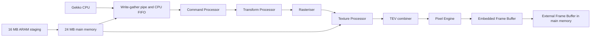
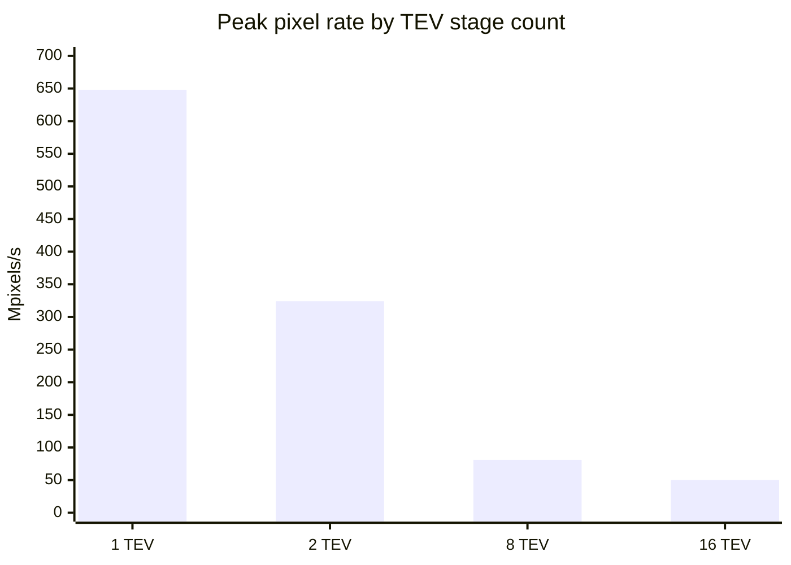
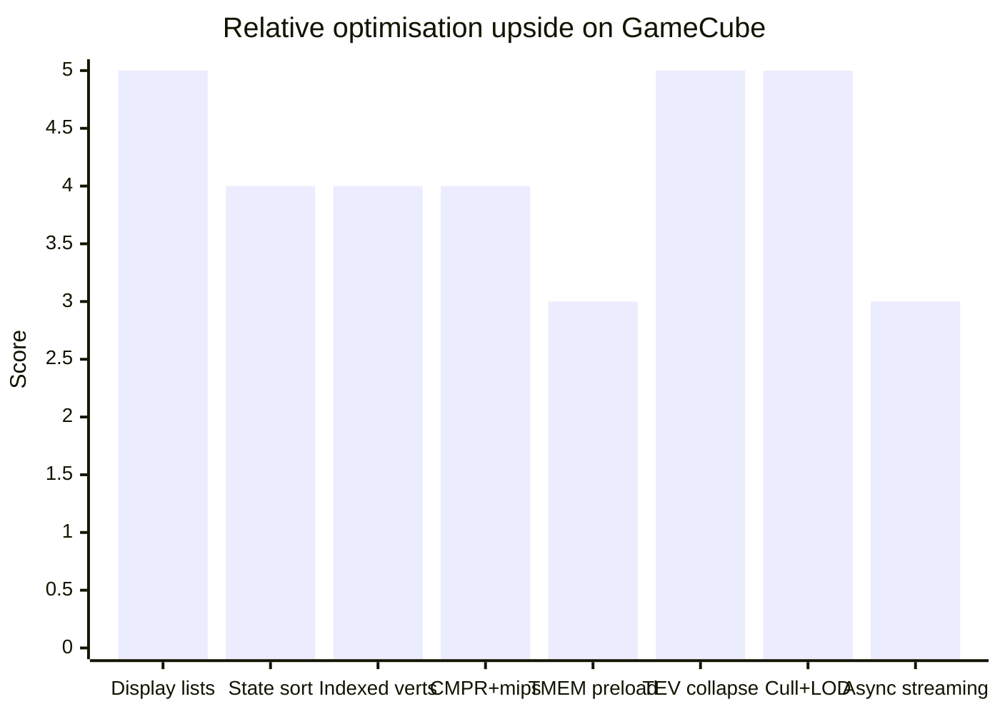

# GameCube Rendering Techniques and Engine Optimisation

## Executive summary

The GameCube is easiest to optimise when you stop thinking of it as a “small PC GPU” and instead treat it as a tightly-coupled command-stream machine: Gekko feeds a thin GX API into Flipper’s fixed-function pipeline, which then lives or dies on how much command traffic, vertex reuse, texture churn, TEV stage pressure, and EFB copy work you make it do. On paper the GP can peak at 648 Mpixels/s and 20M–32M polygons/s depending on features, but those peaks collapse quickly as TEV stages stack up: the official Architecture Guide gives 648 Mpixels/s for one TEV stage, 324 for two, 81 for eight, and 50 for sixteen. In practice, the highest-leverage optimisations are therefore the ones that reduce state changes, collapse TEV work, keep opaque passes Z-friendly, and avoid reloading texture and vertex data unnecessarily. citeturn40view3turn40view4turn11search5

For most engines, the best return on effort comes from five families of changes. First, batch static and semi-static geometry aggressively, ideally using indexed arrays and display lists for repeated material chunks. Second, sort by material and TEV/blend/Z state so that FIFO traffic and state coherence costs are amortised. Third, compress, mip, atlas, and, where appropriate, preload or region-cache textures into TMEM instead of invalidating everything every frame. Fourth, keep hot passes short in TEV terms and rely on XF texgen, TEV register reuse, and EFB copies only when they replace even more expensive multipass work. Fifth, overlap IO and GPU work using FIFO breakpoints, draw-sync tokens, and ARAM/DMA staging rather than letting texture or asset uploads block the frame. citeturn10search1turn37view0turn37view4turn36view4turn36view5turn26view1turn26view6turn40view5turn39view0turn39view2

Because no specific title, content profile, or performance target was supplied, the guidance below is organised by likely bottleneck rather than by genre. Where a technique is a direct feature of the hardware or SDK, I mark it as such; where it is an inference from the hardware model and published GameCube-era engine material, I say so explicitly. Also, when people talk about “microcode hacks” on GameCube, they usually mean GX command-stream choreography, TEV/XF exploitation, or EFB-copy tricks rather than downloadable GPU programmes; the public GX material documents a fixed-function pipeline, command FIFO, and TEV/XF state model, not a user-authored fragment microcode model. citeturn11search5turn10search1turn18view3turn18view4

## Hardware and SDK baseline

Flipper is not just a raster device. ATI’s 2001 implementation paper describes it as the “centrepiece” of Dolphin and notes that it functioned as the graphics processor, audio processor, host controller, memory controller, and I/O processor of the system; Nintendo’s later patent for the graphics/audio processor likewise describes a single-chip ASIC containing the 3D pipeline, display controller, memory interface, processor interface, and audio DSP blocks around an embedded frame buffer. That broad integration is one reason GameCube rendering performance is so sensitive to memory traffic and synchronisation policy: graphics work shares silicon with the rest of the machine rather than sitting behind an isolated desktop-style graphics card boundary. citeturn21view0turn18view0

On the CPU side, Nintendo’s Architecture Guide describes Gekko as running at roughly 486 MHz internally with a 162 MHz, 64-bit bus to main memory for a quoted 1 GB/s peak bandwidth. IBM’s Gekko manual adds the details that matter to engine code: 32 KiB instruction and 32 KiB data caches, a 256 KiB on-chip L2, optional partitioning of the D-cache into a 16 KiB normal cache plus a 16 KiB locked cache, paired-single floating-point extensions, a 15-entry DMA command queue, and a 128-byte write-gather buffer that bursts out 32-byte chunks to external memory. Crucially, the write-gather path is independent enough that it can keep draining while the CPU continues to issue gathered stores, but the manual warns that stores to the gather address can stall once more than about 120 bytes are pending. citeturn40view3turn40view5turn22view4turn38view0turn38view5turn39view0turn39view2turn39view3

The machine’s memory hierarchy is equally distinctive. Nintendo’s functional block diagram shows 24 MB of main 1T-SRAM with 2.6 GB/s bandwidth through Flipper’s memory controller, while ARAM contributes a separate 16 MB pool on an 8-bit bus with a quoted 60–70 MB/s DMA interface to main memory and an 80 MB/s streaming-cache interface to the DSP. Nintendo explicitly states that ARAM, although primarily intended for audio, can also hold graphics and animation data and be paged into main memory with roughly one video frame of latency, making it useful as a staging layer between the slow optical disc and the fast-but-small main memory budget. That matters directly to texture and model streaming policy. citeturn40view5turn40view6

On the graphics side, the official Architecture Guide lays out the GP blocks as Command Processor, Transform Processor, Rasteriser, Texture Processor, Texture Environment Processor, Pixel Engine, on-chip texture memory, and on-chip frame-buffer memory. The same guide quotes 162 MHz GP operation, 20M/27M/32M polygons/s peak depending on feature selection, and a 648 Mpixels/s peak raster rate. It also states that XF performs clipping and backface rejection, while RAS can perform Z tests before texture mapping so that only pixels that survive visibility testing load texels into the texture cache. The rasteriser works on 2×2 “pixel quads”, generating four pixels per clock at peak. citeturn22view0turn40view3turn40view4



The flow above is a synthesis of Nintendo’s GP block diagram, GX’s CPU-to-FIFO documentation, and IBM’s write-gather description. The optimisation consequence is simple: every stage before TEV benefits from not sending unnecessary work, and every stage after TEV benefits from not asking the GP to blend far more layers than the scene really needs. citeturn22view0turn10search1turn38view0

Texture capability is broad for a fixed-function console, but it must be used strategically. The official GX guide lists native formats including I4, I8, IA4, IA8, RGB565, RGB5A3, RGBA8, colour-indexed formats, and CMPR. It also explains that CMPR textures are stored compressed in TMEM and decompressed after lookup and before filtering, which saves space in TMEM and main memory as well as reducing memory traffic. Nintendo’s public technical-data page separately advertises mip-mapping, bilinear, trilinear, anisotropic filtering, hardware texture decompression in real time, and display-list decompression in real time. The TEV is the key differentiator: the Architecture Guide says it can run up to 16 stages, but its peak fill rate drops sharply as stage count rises. citeturn25view0turn25view5turn18view2turn40view3



Those official TEV rates are the clearest single reason to prioritise material simplification on GameCube. If a scene is already overdraw-heavy or alpha-heavy, cutting a pass from eight stages to four is often more valuable than shaving a little CPU work off submission. citeturn40view3

At the SDK/API level, Nintendo’s GX guide describes GX as intentionally “as thin as possible” so that state-setting functions send commands more or less directly to hardware through the command FIFO. The same guide documents immediate-mode FIFO use, multi-buffer FIFO use, breakpoints, draw-sync tokens, display lists, performance counters, texture-region allocators, and TMEM preload regions. In the open-source world, `libogc` is the main readable analogue: its repository is explicitly a “C Library for Wii and Gamecube homebrew”, its `gx.h` documents the GX surface that homebrew code sees, and `gamecube-examples` provides a practical corpus of small, inspectable examples. Commercial GameCube titles used Nintendo’s official SDK, not `libogc`, but `libogc` is valuable because the programming model is recognisably the same and publicly inspectable. citeturn11search5turn10search1turn27search2turn9search1

At the very low level, reverse-engineering references such as YAGCD and WiiBrew are still useful for hardware bring-up and tool building. They document the FIFO aperture at `0xCC008000`, explain that GX traffic is written through the write-gather path, and note that command words are packed/padded through the FIFO interface. I treat these as secondary sources, but they remain useful when you need register-level rather than API-level detail. citeturn23search0turn23search12

## Optimisation catalogue

**Batching and display lists.** Static or quasi-static geometry should be accumulated into larger batches, ideally one batch per material or per tightly-compatible material family. The official GX docs state that display-list commands are prefetched into a separate 4 KB FIFO so the main command stream’s prefetched data is not lost, and they warn that display-list buffers must be 32-byte aligned and should include extra headroom because write-gather flushing and padding can exceed your exact byte estimate. That makes display lists an excellent fit for skyboxes, room chunks, prop kits, HUD widgets, and other repeated or infrequently-updated draw packets. The trade-off is that display lists can bypass some of GX’s run-time state coherence, so the safest pattern is to keep them focused on primitives or tightly-controlled state bundles rather than arbitrary mid-frame state soup. citeturn10search1turn41view2

**State sorting and material bins.** This is an inference from the command model and published engine accounts, but it is a strong one. Because GX is a thin FIFO-driven state API, every texture bind, TEV setup, blend change, and matrix change consumes command bandwidth. On top of that, published GameCube material discussions emphasise TEV resource limits such as the small number of constant colour registers. The obvious consequence is to group draws by texture/TEV/blend/Z state so the FIFO spends more time on geometry and less on repetitive setup. The downside is transparency ordering complexity and a tendency to explode the number of material permutations if artists are given too many combiners with no policy layer above them. citeturn11search5turn18view3

**Indexed vertex data and vertex-cache awareness.** The official GX guide is unusually explicit here: indexed attribute data is cached in the vertex cache, while direct attribute data bypasses it. The `GX_InvVtxCache` documentation further states that invalidating the cache is only a two-GP-clock operation and should be done whenever indexed arrays are relocated or rewritten. This means the best general rule is not “always use indexed data” but “use indexed data when you want reuse.” Static meshes, rigid props, and skinned meshes with attribute sharing benefit from indexed formats; throwaway immediate-mode quads, sprites, or fully-unique vertices may be more convenient in direct mode. Mixing indexed and direct data inside the same vertex is also explicitly supported. citeturn24view0turn24view2turn24view4turn37view0

**Quantised submission formats and fixed-point thinking.** Many GameCube wins come from not shipping floats down the pipe unless the precision is really needed. The GX guide’s indexed-data examples use compact integer formats, and open-source GX code often does the same, for example using `GX_S16` positions and texture coordinates with `GX_RGBA8` colours. This reduces attribute-array footprint, improves cache behaviour, and cuts FIFO bandwidth. On the CPU side, Gekko’s paired-single instructions are the relevant “fast math” feature when floating-point work remains necessary, but the more universal engine optimisation is to quantise the data that you submit to GX. The trade-off is precision management: UI quads and world props tolerate aggressive quantisation better than long-range terrain or bone-space skinning. citeturn24view2turn41view1turn22view4turn38view5

**Primitive topology and hardware texgen.** `libogc`’s `gx.h` notes that triangle strips and fans can improve performance relative to discrete triangles, which matches the era’s general wisdom and the FIFO-driven nature of the pipe. The official GX guide also points out that the hardware can generate texture coordinates from existing vertex data—positions, normals, lighting results, and bump-map modes—describing this as another form of data compression. That is more than a convenience feature: it can materially reduce attribute bandwidth, vertex-cache pressure, and authoring redundancy for environment maps, projected textures, and certain bump or shadow coordinate schemes. The trade-off is a more complex material pipeline and a higher risk of “magic state” that only a few engine programmers understand. citeturn29view1turn24view0turn40view4

**Texture compression, atlasing, palette usage, and mipmapping.** Texture memory pressure is one of the clearest GameCube bottlenecks because TMEM is small and fill work is interleaved with texture fetch. The official GX guide’s CMPR documentation is especially important: CMPR stays compressed in TMEM, is decompressed after lookup and before filtering, and therefore saves both TMEM space and main-memory bandwidth. The same guide also lays out the rules for TLUTs and colour-indexed formats. In engine terms, the obvious strategy is to use CMPR and paletted formats aggressively for diffuse/detail/mix data, atlas small textures when it genuinely reduces state changes, and enable mip/LOD control whenever minification is significant. A particularly useful GameCube-era terrain article describes deduplicating mix-map tiles to save memory and copying adjacent border texels so that bilinear filtering would not expose seams—an example of how atlas-friendly packing on this hardware often required explicit anti-seam logic. citeturn25view0turn25view4turn25view5turn24view8turn18view4

**TMEM preloading and narrow invalidation.** This is one of the most specifically GameCube-friendly optimisation families. GX distinguishes between cache regions and preload regions in TMEM, and the official docs explain that preloaded textures bypass texture-cache tag lookups. The same docs also provide hard timing guidance: `GX_InvalidateTexAll` takes about 512 GP clocks, while invalidating a 32 KB texture region takes only 16 GP clocks. That is a huge difference. The practical consequence is straightforward: if only one atlas page, font sheet, or video surface changed, invalidate that region, not all texture caches. If a texture is hot, stable, and predictable, consider preloading it into TMEM and binding it with the preloaded path rather than hoping the standard cache policy keeps it resident. The price is region-allocation bookkeeping, careful texture-size matching, and the risk of TMEM fragmentation or accidental overlap. citeturn36view4turn36view5turn37view4turn31view1turn33view2turn33view5turn41view3

**TEV combiner tricks and material collapse.** TEV is where GameCube engines differentiate themselves. The Architecture Guide’s stage-rate table makes the cost side plain, while GameCube-era developer writing shows how far teams pushed the benefits. One published article describes three-layer terrain blending using low-bit mix maps plus precomputed shadow data, and another tool postmortem notes that on GameCube a third multiply-mode detail layer was added beyond a simpler two-layer PS2 path. In other words, commercial engines absolutely treated TEV as a programmable-enough combiner that could absorb what would have been multiple passes or even multiple bespoke “shader” families elsewhere. The practical advice is to fold lightmaps, detail maps, modulation, interframe blends, and projected layers into as few TEV stages as possible, while being ruthless about which materials truly deserve long TEV chains. The trade-off is tooling complexity, register pressure, and more subtle visual bugs than in a simpler “one material, one texture” model. citeturn40view3turn18view3turn18view4turn16search15turn41view1

**Opaque-first rendering and overdraw control.** The rasteriser’s ability to perform Z tests before texture mapping makes front-loaded opaque rendering especially valuable on GameCube, because failed pixels never fetch texels into the texture cache. That, in turn, means you should usually sort opaque geometry to maximise early-Z usefulness, keep alpha-tested and blended materials from contaminating the opaque phase, and make sure your most expensive TEV materials are not being sprayed across large areas of hidden screen space. Hardware backface rejection in XF helps too, but only after the object has been submitted, so it is not a substitute for coarse object-level culling on the CPU. citeturn40view4turn10search1

**CPU-side culling and LOD.** Frustum culling, portal/room culling, sector culling, and sensible geometric/material LOD are not “special” GameCube features, but they are especially aligned with GX because they save work in every expensive place at once: fewer commands in the FIFO, fewer transforms in XF, less raster work, fewer texture fetches, and fewer TEV evaluations. On GameCube, LOD should usually be a package deal. Reducing only triangle count but leaving the same texture set, the same TEV chain, and the same alpha-heavy material often misses the true bottleneck. Effective LOD on Flipper generally means fewer triangles *and* cheaper material state *and* smaller or simpler textures. citeturn40view3turn40view4turn18view4

**Occlusion and bounding-box methods.** The Pixel Engine exposes a bounding box of pixels drawn in the EFB, and `libogc` exposes that via `GX_ClearBoundingBox` and `GX_ReadBoundingBox`. The docs warn that the test is effectively quad-based, so results can drift by ±1 pixel and are aligned to 2×2 blocks. This is not a modern hardware occlusion query, but it can be used as a coarse visibility heuristic, a coverage probe, or a debugging instrument. The risk is that it invites synchronisation mistakes: if the engine starts reading back too eagerly or using the result in the same frame without enough latency, you can easily lose more performance than you gain. Treat it as niche, not as a first-line optimisation. citeturn36view2turn36view3turn33view0

**EFB copy tricks and render-to-texture.** `GX_CopyTex` is a genuine GameCube superpower because it lets the GP write textures directly from the EFB, but it is not free. The `libogc` docs say `GX_CopyTex` is useful for GP-generated textures and that `GX_PixModeSync` is specifically the right synchronisation point before a primitive consumes the copied result; by contrast, `GX_CopyDisp` stalls graphics commands until the display copy completes. That makes EFB copies worth using only when they replace something even worse—projected shadows, mirrors, distortion, bloom-like compositing, interframe blending, magnifier effects, and other “screen-space” tricks that TEV alone cannot express cheaply. Used indiscriminately, they quickly become one of the easiest ways to kneecap the frame. citeturn36view0turn10search1turn18view3

**FIFO choreography, DMA scheduling, and asynchronous streaming.** GX’s FIFO model gives you more overlap tools than many game engines actually use. The official docs describe immediate mode, multi-buffer mode, draw-sync tokens, draw-done sync, and FIFO breakpoints; they explicitly state that breakpoints can be used to manage two frames of graphics in the same FIFO. They also warn that polling FIFO status too aggressively is counterproductive, because calling `GXGetFifoStatus` on a CPU-attached FIFO causes a flush and writes 32 bytes of NOPs. On the IO side, Gekko’s DMA engine processes queued transfers sequentially through its 15-entry FIFO, and Nintendo’s ARAM guidance encourages one-frame-latency buffering from disc into ARAM into main memory. `libogc`’s DVD interface exposes both synchronous reads and asynchronous entry points such as `DVD_MountAsync` and `DVD_ReadAbsAsyncPrio`, which is exactly what you want for background texture or chunk staging. The trade-off is complexity and a frame or more of visible latency if the streamer misses its prefetch window. citeturn26view1turn26view4turn26view5turn26view6turn26view7turn39view0turn39view2turn40view5turn43view0turn45view0

## Code patterns and source examples

The snippets below are intentionally short and written in `libogc` style because that is the most accessible public API surface. Where useful, I point to official GX documentation and open-source source files that demonstrate the same pattern. Commercial titles used Nintendo’s SDK rather than `libogc`, but the command model and optimisation idea are the same. citeturn27search2turn10search1turn9search1

**Static geometry batched into a display list.** The important details are the 32-byte alignment requirement, invalidating the destination buffer before filling it through the write-gather path, and leaving safety headroom beyond the exact byte estimate. The official docs and the public NeHe sample both stress these points. citeturn10search1turn41view2

```c
typedef struct {
    void *data;
    u32   size;
} StaticDL;

StaticDL BuildRoomChunkDL(void) {
    StaticDL out = {0};

    const u32 estimated = 4096;
    const u32 padded    = estimated + 64;   // safety headroom for padding / flush rules

    out.data = memalign(32, padded);
    memset(out.data, 0, padded);
    DCInvalidateRange(out.data, padded);

    GX_BeginDispList(out.data, padded);

    GX_Begin(GX_TRIANGLES, GX_VTXFMT0, room_index_count);
    for (u32 i = 0; i < room_index_count; ++i) {
        EmitRoomVertex(i);                  // app-owned helper
    }
    GX_End();

    out.size = GX_EndDispList();
    return out;
}

void DrawRoomChunkDL(const StaticDL *dl) {
    GX_CallDispList(dl->data, dl->size);
}
```

Reference patterns: official `GX_BeginDispList`/`GX_CallDispList` docs and `neheGX/lesson12`’s display-list construction. citeturn10search1turn41view2

**Indexed arrays plus explicit vertex-cache invalidation when data moves.** This is the canonical path for reusable static or semi-static mesh attributes. Indexed attributes hit the vertex cache; direct attributes do not. If you patch or relocate the indexed arrays, invalidate the cache immediately and move on—the official docs say the invalidate is only two GP clocks. citeturn24view2turn37view0

```c
void SetupIndexedMesh(const s16 *pos, const u16 *uv, const u32 *col) {
    GX_ClearVtxDesc();

    GX_SetVtxDesc(GX_VA_POS,  GX_INDEX16);
    GX_SetVtxDesc(GX_VA_TEX0, GX_INDEX16);
    GX_SetVtxDesc(GX_VA_CLR0, GX_INDEX16);

    GX_SetVtxAttrFmt(GX_VTXFMT0, GX_VA_POS,  GX_POS_XYZ, GX_S16, 0);
    GX_SetVtxAttrFmt(GX_VTXFMT0, GX_VA_TEX0, GX_TEX_ST,  GX_S16, 0);
    GX_SetVtxAttrFmt(GX_VTXFMT0, GX_VA_CLR0, GX_CLR_RGBA, GX_RGBA8, 0);

    GX_SetArray(GX_VA_POS,  (void *)pos, sizeof(s16) * 3);
    GX_SetArray(GX_VA_TEX0, (void *)uv,  sizeof(u16) * 2);
    GX_SetArray(GX_VA_CLR0, (void *)col, sizeof(u32));
}

void NotifyMeshArraysChanged(void *base, u32 bytes) {
    DCStoreRange(base, bytes);   // flush CPU writes to memory
    GX_InvVtxCache();            // cheap; only affects indexed attributes
}
```

Reference patterns: GX indexed-array examples in the official guide, plus real-world GX initialisation in mGBA. citeturn24view2turn37view0turn41view1

**CMPR plus mip-filtered texture object.** Use this when the texture is sampled frequently, minifies meaningfully, and can tolerate block compression. CMPR’s big win on GameCube is that it stays compressed in TMEM and decompresses after lookup, so you save memory on both sides of the fetch. citeturn25view0turn24view8

```c
void InitHotDiffuseTex(GXTexObj *obj, void *cmprData, u16 w, u16 h, f32 maxLod) {
    GX_InitTexObj(obj, cmprData, w, h, GX_TF_CMPR,
                  GX_CLAMP, GX_CLAMP, GX_TRUE);

    GX_InitTexObjLOD(obj,
                     GX_LIN_MIP_LIN,   // min filter
                     GX_LINEAR,        // mag filter
                     0.0f, maxLod, 0.0f,
                     GX_FALSE, GX_FALSE, GX_ANISO_1);
}
```

Reference patterns: the GX texture-format and LOD docs, plus open-source code that initialises filter modes and LOD explicitly. citeturn25view0turn24view8turn31view0

**Two-stage TEV combine instead of a second draw pass.** This pattern uses TEV as a small fixed-function “shader”, combining two textures in one chain rather than issuing a separate pass. The exact combine differs per material, but the core economy is universal: if the blend can live inside TEV, it often should. citeturn41view1turn18view3turn16search15

```c
void SetupTwoLayerTev(void) {
    GX_SetNumTevStages(2);
    GX_SetNumTexGens(1);
    GX_SetNumChans(1);

    GX_SetTevOrder(GX_TEVSTAGE0, GX_TEXCOORD0, GX_TEXMAP0, GX_COLOR0A0);
    GX_SetTevOp(GX_TEVSTAGE0, GX_MODULATE);

    GX_SetTevOrder(GX_TEVSTAGE1, GX_TEXCOORD0, GX_TEXMAP1, GX_COLOR0A0);
    GX_SetTevColorOp(GX_TEVSTAGE1, GX_TEV_ADD, GX_TB_ZERO,
                     GX_CS_DIVIDE_2, GX_TRUE, GX_TEVPREV);
    GX_SetTevAlphaOp(GX_TEVSTAGE1, GX_TEV_ADD, GX_TB_ZERO,
                     GX_CS_SCALE_1, GX_TRUE, GX_TEVPREV);

    GX_SetTevColorIn(GX_TEVSTAGE1, GX_CC_ZERO, GX_CC_TEXC,
                     GX_CC_ONE, GX_CC_CPREV);
    GX_SetTevAlphaIn(GX_TEVSTAGE1, GX_CA_ZERO, GX_CA_ZERO,
                     GX_CA_ZERO, GX_CA_APREV);
}
```

Reference patterns: mGBA’s two-texture GX setup and GameCube-era developer writing on multi-layer material systems. citeturn41view1turn18view4turn16search15

**TMEM preload for genuinely hot textures, otherwise narrow invalidation.** Preloading is most useful for textures you know will be sampled heavily and repeatedly. If a texture is dynamic, prefer region-level invalidation to `GX_InvalidateTexAll()` whenever possible. citeturn36view4turn36view5turn33view2turn33view5

```c
void PreloadTexture(GXTexObj *obj, GXTexRegion *region,
                    u32 tmemEven, u32 sizeEven,
                    u32 tmemOdd,  u32 sizeOdd) {
    GX_InitTexPreloadRegion(region, tmemEven, sizeEven, tmemOdd, sizeOdd);
    GX_PreloadEntireTexture(obj, region);
    // Bind later with GX_LoadTexObjPreloaded(...)
}

void RefreshDynamicAtlasRegion(GXTexRegion *region, void *atlasPtr, u32 atlasSize) {
    DCStoreRange(atlasPtr, atlasSize);
    GX_InvalidateTexRegion(region);    // cheaper than invalidating all TMEM caches
}
```

Reference patterns: official `GX_InitTexPreloadRegion`, `GX_PreloadEntireTexture`, `GX_InvalidateTexRegion` docs and `emgba`’s region allocator code. citeturn36view4turn36view5turn33view2turn33view5turn41view3

**Coarse visibility probe via bounding box.** This is a niche tool, but when you need a visibility heuristic for large expensive draws, a frame-late bounding-box probe can sometimes be acceptable. Do not mistake it for a zero-cost occlusion query. citeturn36view2turn36view3turn33view0

```c
typedef struct {
    u16 top, bottom, left, right;
    bool visible;
} OcclusionProbe;

void BeginProbe(void) {
    GX_ClearBoundingBox();
}

OcclusionProbe EndProbe(void) {
    OcclusionProbe p = {0};
    GX_ReadBoundingBox(&p.top, &p.bottom, &p.left, &p.right);
    p.visible = (p.top < p.bottom) && (p.left < p.right);
    return p;
}
```

Reference patterns: `libogc` bounding-box docs and `emgba`’s wrapper around `GX_ReadBoundingBox`. citeturn36view2turn36view3turn33view0

**Asynchronous staging from disc into a texture upload queue.** The exact engine architecture varies, but the public `dvd.h` API is enough to show the pattern: issue a read asynchronously, flush/invalidate caches in the completion path, then flip a “ready for GX upload/bind” bit for the render thread. Pairing this with ARAM staging is often sensible when the optical drive is the true bottleneck. citeturn45view0turn40view5turn43view0

```c
typedef struct {
    dvdcmdblk block;
    void     *staging;
    u32       bytes;
    bool      ready;
} StreamJob;

static void OnTextureChunkRead(s32 result, dvdcmdblk *block) {
    StreamJob *job = (StreamJob *) DVD_GetUserData(block);
    if (result > 0) {
        DCInvalidateRange(job->staging, job->bytes);
        job->ready = true;             // render thread picks it up next frame
    }
}

void QueueTextureChunkRead(StreamJob *job, s64 discOffset, s32 prio) {
    DVD_SetUserData(&job->block, job);
    DVD_ReadAbsAsyncPrio(&job->block, job->staging, job->bytes,
                         discOffset, OnTextureChunkRead, prio);
}
```

Reference patterns: `libogc`’s public DVD header and the simpler synchronous DVD example in `gamecube-examples`. citeturn45view0turn43view0

## Practical checklist and comparison matrix

The fastest way to speed up a GameCube renderer is to identify which of four resource pools is actually failing first: CPU/FIFO submission, vertex throughput, texture/TMEM behaviour, or fill/TEV/overdraw. The tables below are qualitative because no title, scene, or asset profile was provided, but the priority order is grounded in the official hardware/SDK docs and the published engine examples above. citeturn40view3turn37view0turn36view5turn26view1

| Symptom | What to inspect first | Fastest GameCube-specific response | Evidence |
|---|---|---|---|
| CPU thread is busy issuing many small draws | Draw count, material changes, repeated static meshes | Merge by material, build display lists, sort state, stop pushing tiny immediate-mode packets | citeturn10search1turn41view2turn18view3 |
| Vertex-heavy scenes slow down even with simple materials | Whether attributes are indexed or direct; whether vertices are quantised | Move reusable meshes to indexed arrays, use strips/fans where practical, quantise positions/UVs, invalidate vertex cache only when arrays change | citeturn37view0turn24view2turn29view1turn41view1 |
| Texture-heavy scenes “thrash” or stall | Whole-cache invalidation, large dynamic atlases, repeated texture binds | Replace `GX_InvalidateTexAll` with region invalidation, use CMPR/TLUT where acceptable, preload truly hot textures into TMEM | citeturn36view5turn37view4turn25view0 |
| Alpha or layered materials crush frame rate | TEV stage count, overdraw, translucent ordering | Collapse TEV chains, move work to opaque-first passes, strip detail/light layers from distant LODs | citeturn40view3turn40view4turn18view4 |
| Streaming causes hitches | Synchronous IO on render path, no ARAM staging, no prefetch window | Read asynchronously, stage through ARAM if needed, prefetch at least one frame earlier than use | citeturn40view5turn45view0turn43view0 |
| EFB effects cause frame spikes | Number of `GX_CopyTex` / `GX_CopyDisp` operations and reuse timing | Keep only copies that replace more expensive multipass shading, sync with `GX_PixModeSync`, avoid gratuitous display copies | citeturn36view0turn10search1 |
| Visibility work is still too high | Coarse culling stage happens too late | Add CPU frustum/sector/portal culling; use bounding-box probing only as a niche fallback | citeturn40view4turn36view3 |
| FIFO synchronisation looks noisy | Status polling and frame overlap policy | Use draw-sync tokens and FIFO breakpoints; do not poll FIFO status in a tight loop | citeturn26view1turn26view5turn26view6 |

The chart below is an editorial “relative upside” score, not a benchmark. It is intended to show where effort usually pays off first on GameCube-class content. citeturn40view3turn10search1turn37view0turn36view5turn26view1



| Technique | Bottleneck relieved | Expected gain | Implementation complexity | Risk | Best used when | Evidence |
|---|---|---|---|---|---|---|
| Static batching with display lists | CPU/FIFO | Very high | Medium | Medium | Room chunks, props, UI, repeated rigid meshes | citeturn10search1turn41view2 |
| Material/state sorting | CPU/FIFO, TEV setup | High | Medium | Medium | Many small materials and texture binds | citeturn11search5turn18view3 |
| Indexed arrays plus vertex-cache use | Vertex submission | High | Low–Medium | Low | Reusable mesh topology, shared attributes | citeturn24view2turn37view0 |
| Quantised vertex formats | CPU/FIFO, memory | Moderate–High | Medium | Low | Props, UI, terrain chunks, static meshes | citeturn24view2turn41view1 |
| Triangle strips/fans and XF texgen | Vertex/FIFO bandwidth | Moderate | Medium | Medium | Terrain, ribbons, projected/env-mapped materials | citeturn29view1turn24view0 |
| CMPR / TLUT / mipmapping | Texture bandwidth, TMEM | High | Low–Medium | Low–Medium | Diffuse/detail textures with minification | citeturn25view0turn25view4turn24view8 |
| TMEM preload plus region invalidation | Texture-cache churn | High in hot-texture scenes | High | Medium | Fonts, UI, stable atlases, video surfaces | citeturn36view4turn36view5turn37view4 |
| TEV-stage collapse and combiner reuse | Fill/TEV | Very high | High | High | Layered terrain, light/detail/interframe materials | citeturn40view3turn18view4turn16search15 |
| Opaque-first ordering and culling | Fill/overdraw | Very high | Low–Medium | Low | Outdoor scenes, alpha-heavy sets, dense interiors | citeturn40view4turn10search1 |
| LOD that also simplifies materials | Vertex + fill + texture | High | Medium–High | Medium | Distant geometry that still uses costly materials | citeturn40view3turn18view4 |
| Bounding-box-based coarse occlusion | Submission/fill | Situational | Medium | High | Large expensive objects with tolerant latency | citeturn36view3turn33view0 |
| EFB-copy tricks | TEV substitution / special effects | Situational–High | High | High | Mirrors, projected shadows, distortion, video filters | citeturn36view0turn10search1 |
| FIFO breakpoints and frame overlap | CPU/GP overlap | Moderate | High | High | Engines already close to pipelined submission | citeturn26view1turn26view6 |
| Async DVD/ARAM/DMA scheduling | IO stalls | Moderate–High | High | Medium | Streaming worlds, large texture/model pages | citeturn40view5turn39view2turn45view0 |

## Source register

Several of the strongest historical references below are mirrored online copies of period Nintendo/IBM developer documentation and are labelled as developer/confidential materials in the documents themselves. Public, unencumbered primary sources for GameCube internals are much scarcer than for later platforms, so I prioritised those historical manuals alongside public `libogc` documentation, open-source GX code, and developer-authored articles. citeturn22view3turn22view4turn23search20turn27search2

| Source | Type | Why it matters | URL |
|---|---|---|---|
| Nintendo GameCube Architecture Guide | Historical official developer manual | Best public source for GP/XF/RAS/TEV/ARAM performance characteristics | `https://db.hfsplay.fr/files/2019/07/04/Architecture_Guide_SCQNknY.pdf` |
| Revolution Graphics Library (GX) | Historical official GX manual | Main source for FIFO, display lists, TMEM, metrics, texture formats, TEV API concepts | `https://www.davidgf.net/downloads/gcwii/gx.pdf` |
| IBM Gekko RISC Microprocessor User’s Manual | Historical official CPU manual | Primary source for paired-single, write-gather, DMA queue, locked cache, L2 | `https://datasheets.chipdb.org/IBM/PowerPC/Gekko/gekko_user_manual.pdf` |
| Nintendo UK Technical Data | Public Nintendo page | Public summary of GameCube imaging features such as mipmaps, S3TC, multitexturing | `https://www.nintendo.com/en-gb/Support/Legacy-system/Technical-data-619165.html` |
| US6937245B1 Graphics system with embedded frame buffer | Nintendo/ATI patent | Primary architectural description of Flipper-class graphics/audio ASIC | `https://patents.google.com/patent/US6937245B1/en` |
| Implementation of the ATI Flipper Chip | ATI paper | Original paper confirming Flipper’s integrated role in Dolphin | `https://past.date-conference.com/proceedings-archive/2001/DATE01/PDFFILES/09E_2.PDF` |
| `libogc` GX API docs | Public API reference | Readable documentation for today’s open GX analogue | `https://libogc.devkitpro.org/gx_8h.html` |
| `libogc` repository | Open-source library | Public source for GameCube/Wii homebrew API surface | `https://github.com/devkitPro/libogc` |
| `gamecube-examples` repository | Open-source examples | Practical GX and DVD demos | `https://github.com/devkitPro/gamecube-examples` |
| `lesson12.c` NeHe GX example | Open-source source file | Display-list batching, TEV and texture setup example | `https://github.com/devkitPro/gamecube-examples/blob/master/graphics/gx/neheGX/lesson12/source/lesson12.c` |
| `dvd.c` DVD example | Open-source source file | Simple disc-read pattern illustrating DVD IO setup | `https://github.com/devkitPro/gamecube-examples/blob/master/devices/dvd/readsector/source/dvd.c` |
| `dvd.h` from `libogc` | Open-source header | Public declaration of async DVD entry points such as `DVD_ReadAbsAsyncPrio` | `https://raw.githubusercontent.com/devkitPro/libogc/master/gc/ogc/dvd.h` |
| `gcvideo.cpp` from FCE Ultra GX | Open-source source file | Real-world `GX_InvalidateTexAll` and texture-object initialisation usage | `https://github.com/dborth/fceugx/blob/master/source/gcvideo.cpp` |
| `main.c` from mGBA Wii | Open-source source file | Concise TEV setup, cache invalidation, and texture-object examples | `https://github.com/mgba-emu/mgba/blob/master/src/platform/wii/main.c` |
| `gx.c` from emGBA | Open-source source file | Custom TMEM region callbacks, preload regions, TLUT regions, bounding-box wrapper | `https://github.com/extremscorner/emgba/blob/main/source/gx.c` |
| Shader Integration: Merging Shading Technologies on the Nintendo GameCube | Developer-authored article | Excellent period discussion of TEV/material limits and memory-saving terrain blending | `https://www.gamedeveloper.com/programming/shader-integration-merging-shading-technologies-on-the-nintendo-gamecube` |
| Tool Postmortem: Climax Brighton’s Supertools | Developer-authored article | Mentions GameCube-specific extra detail-layer material path | `https://www.gamedeveloper.com/programming/tool-postmortem-climax-brighton-s-supertools` |
| YAGCD chapter on hardware registers | Reverse-engineered reference | Useful low-level FIFO/WGPIPE/register detail | `https://hitmen.c02.at/files/yagcd/yagcd/chap5.html` |
| YAGCD chapter on graphic formats | Reverse-engineered reference | Useful supplement on texture/compression formats | `https://hitmen.c02.at/files/yagcd/yagcd/chap17.html` |
| YAGCD appendix | Reverse-engineered reference | Useful ARAM and file-format notes | `https://hitmen.c02.at/files/yagcd/yagcd/chap18.html` |
| WiiBrew Hardware/GX | Reverse-engineered reference | Practical note on WGPIPE/FIFO semantics | `https://wiibrew.org/wiki/Hardware/GX` |